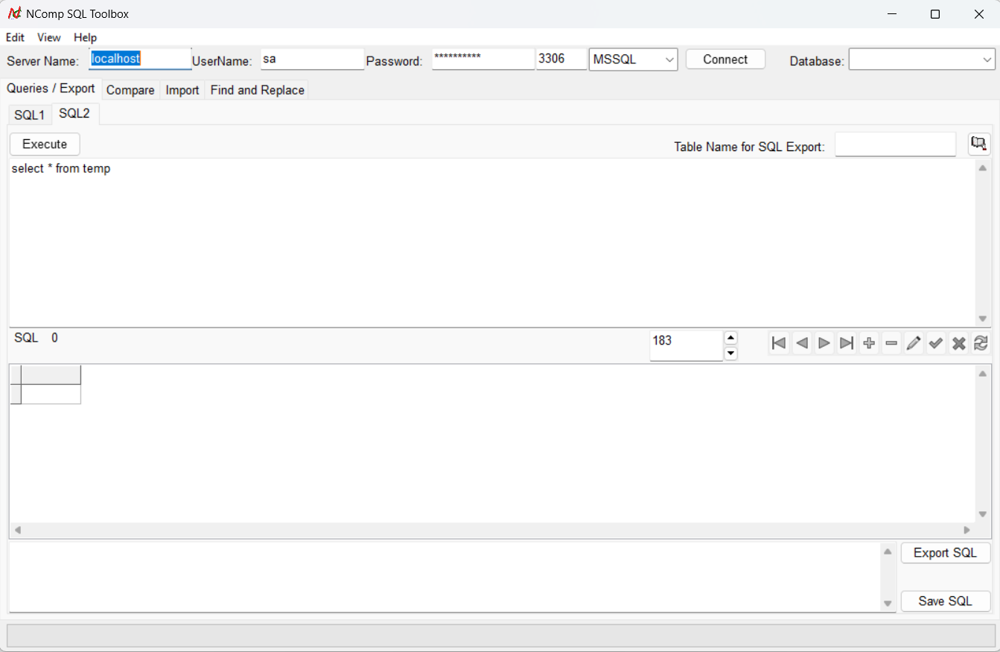
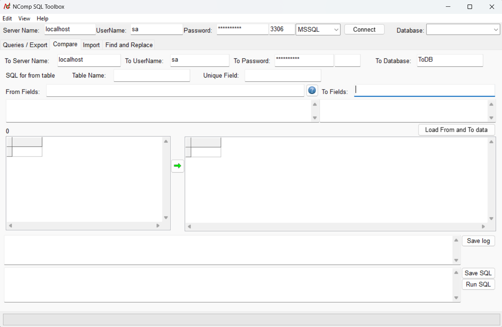
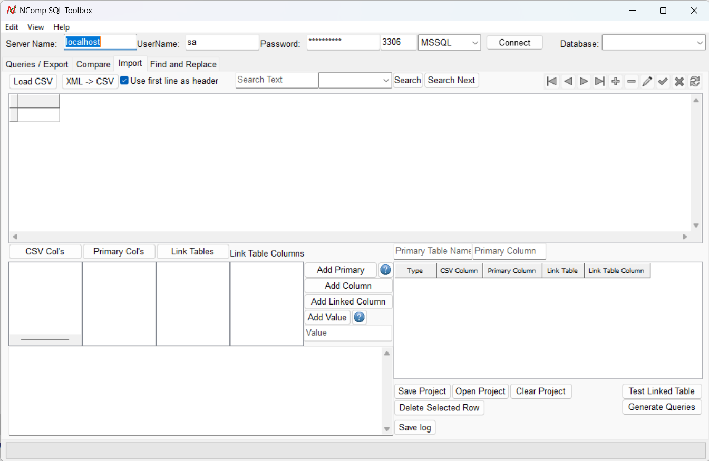

# 🧰 NComp SQL Toolbox

**NComp SQL Toolbox** is a lightweight SQL utility for Windows and Linux that simplifies data querying, import, comparison, and transformation for both **Microsoft SQL Server (MSSQL)** and **MySQL** databases.

---

## 🔍 Overview

This tool provides essential SQL management and data import functionality through a user-friendly interface. Whether you're a developer, analyst, or DBA, it offers quick access to SQL tasks without needing a heavy IDE.

---

## ✨ Features

### 1. 📝 SQL IDE
- Connect to **MSSQL** or **MySQL**.
- Run SQL queries and view results in a grid.
- Export result sets as `INSERT` or `UPDATE` SQL scripts.
- Edit and manage data directly from query results.

### 2. 🔄 Table Comparison
- Compare tables between two databases with identical structures.
- Generates `INSERT` and `UPDATE` SQL scripts for syncing.
- Supports joins to filter records using related tables.

### 3. 📥 Import Utilities
- Load data from **CSV** or **XML** sources.
- Map and transform data into database tables.
- Define primary/linked fields and generate insert/update statements.

### 4. 🔍 Find and Replace
- Search across multiple tables and columns.
- Optionally replace matching values in-place.
- Useful for cleaning up or updating data in bulk.

---

## 💻 Platforms

- ✅ Windows (32-bit & 64-bit)
- ✅ Linux (Debian-based)

---

## 📦 Installation

**Official Downloads:**  
➡️ [NComp SQL Toolbox](https://www.ncomp.co.za/index.php/software/ncomp-mssql-toolbox)

Or clone the repo and build it using [Lazarus IDE](https://www.lazarus-ide.org/).

---

## 🖼 Screenshots

  
  

*(Screenshots captured on Windows 11)*

---

## ⚙️ Requirements

- MSSQL or MySQL server connection.
- Lazarus IDE (for building from source).
- FPC-compatible OpenSSL for SSL connections.

---

## 📚 License

This project is released under the [GPL-3.0 license ](LICENSE).

---

## 💬 Feedback and Support

If you find a bug or have feature suggestions, feel free to [open an issue](https://github.com/NielBuys/NComp-MSSQL-Toolbox/issues) or contact via [ncomp.co.za](https://www.ncomp.co.za/).
