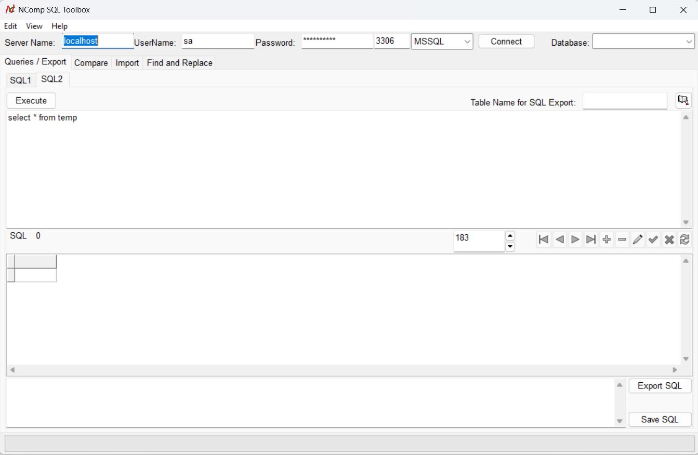
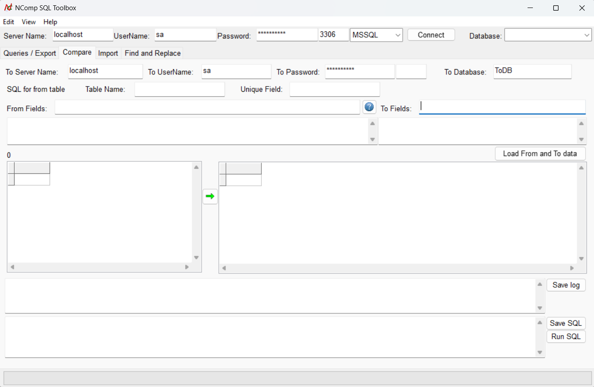
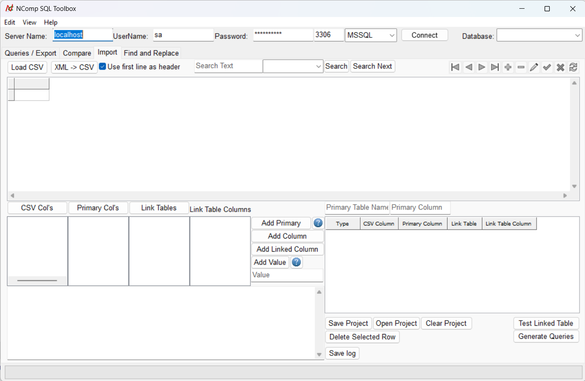

# 🧰 NComp SQL Toolbox

**NComp SQL Toolbox** is a lightweight SQL utility for Windows and Linux that simplifies data querying, import, comparison, and transformation across **Microsoft SQL Server (MSSQL)**, **MySQL**, and **SQLite** databases.

---

## 🔍 Overview

This tool provides essential SQL management and data import functionality through a user-friendly interface. Whether you're a developer, analyst, or DBA, it offers quick access to SQL tasks without needing a heavy IDE.

---

## ✨ Features

### 1. 📝 SQL IDE
- Connect to **MSSQL**, **MySQL**, or **SQLite**.
- Work with **multiple query tabs** — add, remove, and rename tabs, each with its own editor and result grid. Open tabs and their SQL are remembered between sessions.
- Run or Execute SQL queries and view results in a grid.
- Right-click any result cell and choose **View Content** to see (or, when *Resultset Editable* is on, edit) the full value of long text fields in a pop-up.
- Export result sets as `INSERT` or `UPDATE` SQL scripts, or as **CSV**.
- Edit and manage data directly from query results.

### 2. 🗂 Tables Directory
- Browse **tables, columns, and views** for the connected database, each with its own search box.
- A separate **Functions / Procedures** tab lists **scalar functions**, **table-valued functions**, and **stored procedures** (where the engine supports them).
- Press **Ctrl+A** on any list to insert the selected name straight into the query editor.

### 3. 🔄 Table Comparison
- Compare tables between two databases with identical structures.
- Generates `INSERT` and `UPDATE` SQL scripts for syncing.
- Supports joins to filter records using related tables.

### 4. 📥 Import Utilities
- Load data from **CSV** or **XML** sources.
- Map and transform data into database tables.
- Define primary/linked fields and generate insert/update statements.

### 5. 🔍 Find and Replace
- Search across multiple tables and columns.
- Optionally replace matching values in-place.
- Useful for cleaning up or updating data in bulk.

> **Note on database engines:** SQLite databases are single files (no server, user, or password) and do not have stored procedures or schema-stored functions, so those lists appear empty. MySQL functions are all scalar (MySQL has no table-valued functions).

---

## 💻 Platforms

- ✅ Windows (32-bit & 64-bit)
- ✅ Linux (Debian-based)

---

## 📦 Installation

**Official Downloads:**  
➡️ [NComp SQL Toolbox](https://www.ncomp.co.za/index.php/software/ncomp-mssql-toolbox)

Or clone the repo and build it using [Lazarus IDE](https://www.lazarus-ide.org/).

---

## 🖼 Screenshots

  
  

*(Screenshots captured on Windows 11)*

---

## ⚙️ Requirements

- A connection to an **MSSQL** or **MySQL** server, or a local **SQLite** database file.
- The matching native client library must be reachable at runtime (next to the executable on Windows, or system-installed on Linux):
  - **MSSQL** — FreeTDS `dblib.dll` (bundled in the `MSSQL 32bit dblib` / `MSSQL 64bit dblib` folders).
  - **MySQL** — `libmysql.dll` (bundled in the `MySQL 64bit` folder).
  - **SQLite** — `sqlite3.dll` on Windows (download the *x64* build from [sqlite.org/download.html](https://sqlite.org/download.html) and place it beside the `.exe`); `libsqlite3` on Linux (`sudo apt install libsqlite3-0`).
- Lazarus IDE (for building from source).

---

## 📚 License

This project is released under the [GPL-3.0 license ](LICENSE).

---

## 💬 Feedback and Support

If you find a bug or have feature suggestions, feel free to [open an issue](https://github.com/NielBuys/NComp-MSSQL-Toolbox/issues) or contact via [ncomp.co.za](https://www.ncomp.co.za/).
